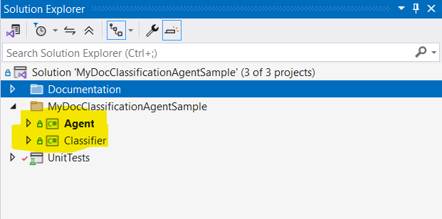
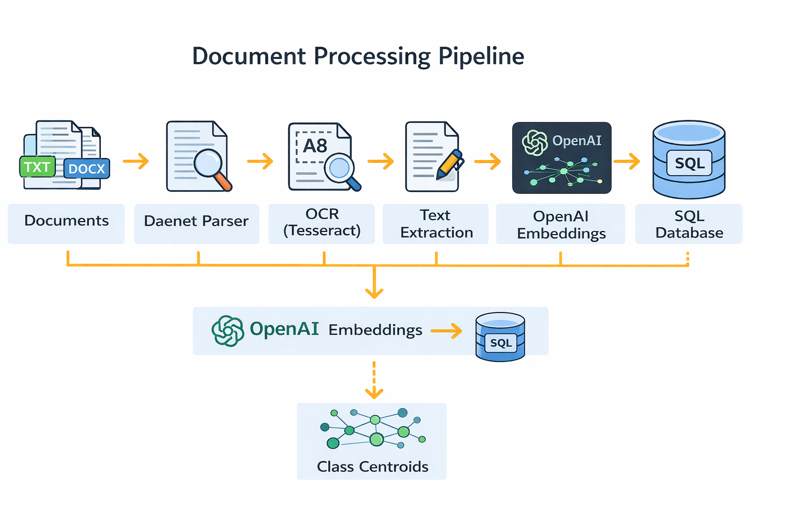
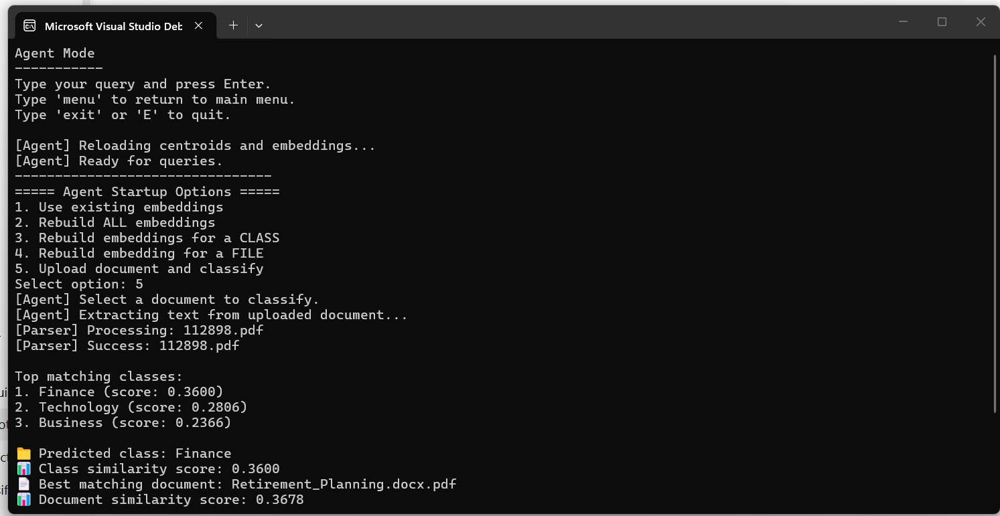

# AI Document Classification Agent

---


## 1. Project Overview

The AI Document Classification Agent is a semantic document processing system that classifies documents based on their meaning rather than keywords.

The system supports multiple formats including PDF, DOCX, TXT, and images. Text is extracted using `Daenet.DocumentParser` for structured files and Tesseract OCR for scanned documents.

Each document is converted into a vector representation using the OpenAI embedding model (`text-embedding-3-large`) and stored in a SQL Server database. Class-level centroids are computed from these embeddings to represent each category.

The system uses a two-stage retrieval process:

1. Class selection by comparing the query embedding with class centroids
2. Document ranking within the selected class using cosine similarity

The architecture is divided into a Classifier module for embedding generation and centroid computation, and an Agent module for handling user queries and classification.

---

## 2. System Architecture

The system consists of two main components: a Classifier for document processing and an Agent for query-based retrieval. Documents are processed into embeddings and stored in SQL Server, while the Agent performs semantic search using a two-stage retrieval approach (class-level then document-level).



### 2.1 Components

| Component | Description |
| --- | --- |
| Classifier | Processes documents, generates embeddings, computes centroids |
| Agent | Handles queries and performs semantic retrieval |
| Database | SQL Server storing embeddings and centroids |
| Parser | Extracts text from documents (OCR supported) |
| Embedding Service | Generates embeddings using OpenAI |

### 2.2 Processing Pipeline



1. Extract text from documents (OCR supported)
2. Generate embeddings using OpenAI
3. Store embeddings in SQL Server
4. Compute class centroids
5. Generate query embedding
6. Compare with centroids (class selection)
7. Compare with document embeddings (final result)

### 2.3 Architecture Style

- Layered Architecture (Agent / Classifier / Persistence)
- Repository Pattern (`SqlEmbeddingRepository`)
- Service-based design (`EmbeddingBuildService`, Parser)

### 2.4 Data Storage

Document embeddings and class centroids are stored as JSON in SQL Server across the following tables:

- `DocumentClasses`
- `Documents`
- `DocumentEmbeddings`
- `ClassCentroids`

### 2.5 Dependency Injection Configuration

The project uses .NET's built-in Dependency Injection to manage service lifetimes and decouple components. Services are registered in `Program.cs` as follows:

```csharp
services.AddSingleton<IDocumentPreprocessor, ExternalDocumentPreprocessor>();
services.AddSingleton<IEmbeddingGenerator, OpenAiEmbeddingGenerator>();
services.AddScoped<IEmbeddingRepository, SqlEmbeddingRepository>();
services.AddSingleton<DocumentClassificationRunner>();
```

**Service responsibilities:**

| Interface | Implementation | Responsibility |
| --- | --- | --- |
| `IDocumentPreprocessor` | `ExternalDocumentPreprocessor` | Handles document parsing across all supported formats using `Daenet.DocumentParser` |
| `IEmbeddingGenerator` | `OpenAiEmbeddingGenerator` | Sends document text to the OpenAI API and returns vector embeddings |
| `IEmbeddingRepository` | `SqlEmbeddingRepository` | Persists embeddings and class centroids to SQL Server via EF Core |
| `DocumentClassificationRunner` | N/A | Orchestrates the full classification workflow end-to-end |

**Service lifetimes:**

| Lifetime | Used For | Reason |
|----------|----------|--------|
| `Singleton` | Document parser, embedding generator | Stateless services — safe and efficient to share across the application lifetime |
| `Scoped` | Database repository | Creates a fresh instance per operation, ensuring clean EF Core context handling |

> Using `Scoped` for the repository prevents EF Core context conflicts that would occur if the same `DbContext` instance were reused across concurrent or sequential operations.

### 2.6 Design Decisions

- Two-stage retrieval used for better semantic matching accuracy
- Embeddings stored in SQL Server instead of flat files for persistence and scalability
- OCR integrated to support image-based documents
- Modular separation between Agent and Classifier for independent development and testing

---

## 3. Core Concepts

### 3.1 Semantic Embeddings

Documents and queries are converted into high-dimensional vector representations using the OpenAI Embeddings API and stored in SQL Server for retrieval.

### 3.2 Cosine Similarity

```
Similarity(A, B) = (A · B) / (|A| × |B|)
```

Used for:

- Class matching — query embedding compared against class centroids
- Document matching — query embedding compared against individual document embeddings

### 3.3 Class Centroids

```
Centroid = (v1 + v2 + ... + vn) / n
```

Each class is represented as the average of all its document embeddings. Centroids are used for fast class-level filtering before document-level ranking.

---

## 4. Core Classes

### 4.1 Classifier Module

| Class | Methods / Responsibility |
|-------|--------------------------|
| `DocumentClassificationRunner` | `RunAsync()`, `GenerateSingleAsync()` — Orchestrates the document processing pipeline |
| `ExternalDocumentPreprocessor` | Uses `Daenet.DocumentParser`; supports TXT, PDF, DOCX, and images via Tesseract OCR |
| `OpenAiEmbeddingGenerator` | Calls OpenAI API to generate vector embeddings |
| `EmbeddingBuildService` | `BuildAllAsync()`, `BuildClassAsync()`, `BuildFileAsync()`, `ClassifyUploadedDocumentAsync()` |
| `CentroidCalculator` | `Compute()` — Calculates class centroid vectors |
| `SqlEmbeddingRepository` | Handles all database operations (store and load embeddings and centroids) |
| `CosineSimilarity` | Computes similarity score between two vectors |

### 4.2 Agent Module

**Query processing workflow:**

| Step | Description |
|------|-------------|
| 1 | Read user query or uploaded document |
| 2 | Generate embedding for input |
| 3 | Compare with class centroids |
| 4 | Select best matching class |
| 5 | Compare with document embeddings within the selected class |
| 6 | Return best matching document and confidence scores |

**Core interface:**

| Interface | Method | Description |
|-----------|--------|-------------|
| `ISimilarityMetric` | `Compute(float[] a, float[] b)` | Calculates similarity score between two vectors |

**Core classes:**

| Class | Methods / Responsibility |
|-------|--------------------------|
| `AgentRunner` | `RunAsync(input)` — Main entry point for query handling |
| `AgentIntentEmbeddingService` | `GenerateIntentEmbeddingAsync()` — Generates query embeddings |
| `AgentSimilarityMatcher` | `RankClasses()`, `RankTopClasses()` — Performs class ranking |
| `CosineSimilarityMetric` | Implements the similarity calculation interface |
| `AgentResultFormatter` | Formats and displays classification results |

**Example output:**



---

## 5. Project Structure

```
ML-25-26-02-AI-Document-Classification-Agent-PlugIn
│
├── MyDocClassificationAgentSample.sln
├── MyDocClassificationAgentSample
│   ├── Agent
│   │   ├── Program.cs              # Interactive semantic search agent
│   │   ├── Similarity              # Query ranking and similarity logic
│   │   └── appsettings.json        # Azure SQL connection string
│   │
│   └── Classifier
│       ├── Program.cs              # Document ingestion and embedding pipeline
│       ├── Documents               # Training documents grouped by class
│       ├── Embeddings              # OpenAI embedding integration
│       ├── Migrations              # EF Core migrations
│       ├── Persistence             # DbContext, entities, repositories
│       ├── PreProcessing           # File parsing and OCR handling
│       ├── Similarity              # Centroid and similarity helpers
│       ├── tessdata                # OCR language data used by Tesseract
│       └── appsettings.json        # Azure SQL connection string
│
├── UnitTests                       # Automated tests
└── Documentation                   # README and architecture images
```

> Each subfolder inside `Documents/` represents a class label. All files within a folder are treated as belonging to that class during training.

---

## 6. Technologies Used

| Technology | Purpose |
|------------|---------|
| C# / .NET | Core application language and runtime |
| Entity Framework Core | ORM for database access and migrations |
| Microsoft SQL Server | Persistent storage for embeddings and centroids |
| OpenAI API | Embedding generation for documents and queries |
| Tesseract OCR | Text extraction from image files (`.png`, `.jpg`) |
| MSTests | Unit testing framework |
| Moq | Mocking framework for unit tests |

---

## 7. Supported File Formats

| Format | Method |
|--------|--------|
| `.txt` | Direct text parsing |
| `.docx` | OpenXML extraction |
| `.pdf` | Text layer extraction |
| `.png` / `.jpg` | OCR via Tesseract *(setup required — see Section 8.3)* |

---

## 8. Project Setup Guide

Complete instructions for setting up and running the application on Windows and macOS.

---

### 8.1 Prerequisites

Install the following:

- .NET SDK 9.0 or newer
- Git (optional)
- Rider, Visual Studio Code, or Visual Studio (recommended)
- Tesseract OCR if you want to process image files

Verify installation:

```bash
dotnet --version
```

---

### 8.2 Database Setup (Azure SQL)

This project is currently configured to use a shared Azure SQL database, not a local Docker or SQL Server Express instance.

Both applications read the connection string from:

- `MyDocClassificationAgentSample/Classifier/appsettings.json`
- `MyDocClassificationAgentSample/Agent/appsettings.json`

The current key name is:

```json
{
  "ConnectionStrings": {
    "DefaultConnection": "Server=tcp:<azure-sql-server>,1433;Initial Catalog=<database>;User ID=<user>;Password=<password>;Encrypt=True;TrustServerCertificate=False;Connection Timeout=30;"
  }
}
```

> The database schema is applied automatically on startup through `context.Database.Migrate()`. No separate migration command is required for normal use.

**Important**

- If you change the connection string, update it in both the Agent and Classifier projects.
- On first startup, the app must be able to reach Azure SQL over TCP port `1433`.
- If the app times out before login, the most common cause is Azure SQL firewall or network access, not EF Core code.

**macOS / network troubleshooting**

If Windows or another Mac can connect but your Mac cannot, test these:

```bash
nslookup fra-uas-server.database.windows.net
nc -G 5 -vz fra-uas-server.database.windows.net 1433
```

Typical causes of timeout on macOS:

- Your current public IP is not allowed in the Azure SQL firewall
- VPN or university security software is changing your network path
- Your current Wi-Fi or ISP path is blocking outbound port `1433`

If `nslookup` works but `nc` times out, the problem is network reachability to Azure SQL rather than a code bug in the project.

---

### 8.3 OCR Setup (Tesseract)

> Required only for image files (`.png`, `.jpg`). Skip this section if you are not processing images.

**Windows**

Step 1 — Install Tesseract. Download from: https://github.com/UB-Mannheim/tesseract/wiki and install to:

```
C:\Program Files\Tesseract-OCR
```

Step 2 — Add to PATH:

```
C:\Program Files\Tesseract-OCR
```

Step 3 — Verify:

```bash
tesseract --version
```

Step 4 — Native Libraries.

Copy the following DLLs to your current build output folder if needed:

```
tesseract50.dll
leptonica-1.82.0.dll
```

**macOS**

Step 1 — Install OCR:

```bash
brew install tesseract
brew install leptonica
```

Step 2 — Verify:

```bash
tesseract --version
```

Step 3 — Configure environment (CRITICAL):

```bash
export TESSDATA_PREFIX=/opt/homebrew/Cellar/tesseract/5.*/share/tessdata
export DYLD_LIBRARY_PATH=/opt/homebrew/lib:$DYLD_LIBRARY_PATH
```

Step 4 — If OCR still fails, verify that the runtime can see the packaged `tessdata` folder copied to the build output. If needed, set the environment variable manually before running:

```bash
export TESSDATA_PREFIX=/opt/homebrew/Cellar/tesseract/5.*/share/tessdata
```

---

### 8.4 Project Configuration

Clone the repository:

```bash
git clone <repo-url>
cd <project-folder>
```

Update both `appsettings.json` files if your team gives you a different Azure SQL connection string:

- `MyDocClassificationAgentSample/Classifier/appsettings.json`
- `MyDocClassificationAgentSample/Agent/appsettings.json`

Place your documents in the `Documents/` folder, organized by category:

```
Documents/
├── Agriculture/
├── Science/
├── Sports/
├── History/
└── ...
```

Each subfolder name becomes a document class. All files inside are treated as belonging to that class.

---

### 8.5 Set OpenAI API Key

Windows:

```cmd
setx OPENAI_API_KEY "your_api_key_here"
```

> Restart your terminal after running `setx` for the change to take effect.

macOS / Linux:

```bash
export OPENAI_API_KEY="your_api_key_here"
```

To make this permanent on macOS, add the line above to your `~/.zshrc` or `~/.bashrc` file.

---

### 8.6 Build Project

```bash
dotnet restore
dotnet build MyDocClassificationAgentSample.sln
```

---

### 8.7 Run Application

> Run the Classifier first, then the Agent. The Agent depends on data produced by the Classifier.

Run Classifier:

```bash
dotnet run --project MyDocClassificationAgentSample/Classifier/Classifier.csproj
```

This will:

- Parse all documents in the `Documents/` folder
- Generate embeddings for each document
- Compute class centroids
- Persist all data to SQL Server

Run Agent:

```bash
dotnet run --project MyDocClassificationAgentSample/Agent/Agent.csproj
```

This will:

- Accept user input / queries
- Match input against stored embeddings
- Predict and return the document class

---

### 8.8 Common Errors and Fixes

| Error | Cause | Fix |
|-------|-------|-----|
| SQL connection timed out | Azure SQL not reachable | Check firewall allowlist, VPN, Wi-Fi, and port `1433` reachability |
| Login failed | Wrong Azure SQL credentials | Verify `DefaultConnection` in both `appsettings.json` files |
| `OPENAI_API_KEY loaded? NO` | API key not set in shell | Export `OPENAI_API_KEY` and restart the terminal or IDE |
| `DllNotFoundException` (Windows) | Missing native DLLs | Copy required libraries to output folder |
| Parser error (macOS) | OCR not linked | Set `TESSDATA_PREFIX` and `DYLD_LIBRARY_PATH` |
| `tesseract` not recognized | PATH not configured | Add Tesseract install directory to PATH |
| Image parsing fails | OCR not configured | Install and configure Tesseract |

---

## 9. Testing

This project uses **xUnit** as the primary testing framework, with **Moq** for mocking dependencies.

Current tests cover:

- Agent embedding service behavior
- Agent result formatting
- Agent similarity matching
- Centroid calculation
- Document classification runner flow

Run all tests:

```bash
dotnet test
```

---

## 10. Logging

Structured logging is implemented throughout the application using `ILogger<T>`, with EF Core query logging filtered out for improved readability in development.

| Level | Usage |
|-------|-------|
| `Information` | Application startup, classification results |
| `Warning` | Missing files, low-confidence predictions |
| `Error` | Parsing failures, database errors, API failures |

> EF Core logs are suppressed at `Warning` level and above to keep output clean during development. This can be adjusted in `appsettings.json` under `Logging:LogLevel`.

---

## 11. Demo / Example Output

**Input query:**

```
"Machine learning notes"
```

**Agent output:**

```
Predicted Class : Education
Matched File    : ML_Notes.pdf
Confidence      : 0.94
```

**Batch classification (Classifier run):**

```
[INFO] Parsing documents...
[INFO] Agriculture  → 12 documents loaded
[INFO] Finance      →  8 documents loaded
[INFO] Education    → 15 documents loaded

[INFO] Generating embeddings...
[INFO] Computing centroids...
[INFO] Persisting to database...

[SUCCESS] Classification complete. 35 documents indexed.
```

---

## 12. Future Improvements

| Improvement | Description |
|-------------|-------------|
| REST API | Expose classification as an HTTP endpoint using ASP.NET Core Web API |
| Cloud Deployment | Deploy to AWS (EC2 + RDS) or Azure for scalable, production-ready hosting |
| Real-Time Classification | Stream document input and return predictions without manual re-runs |
| UI Dashboard | Web-based interface for uploading documents and viewing classification results |
| Model Fine-Tuning | Replace centroid matching with a fine-tuned classifier for higher accuracy |
| More File Formats | Extend support to `.xlsx`, `.pptx`, `.html`, and scanned multi-page PDFs |
| Authentication | Add user authentication and per-user document management |
